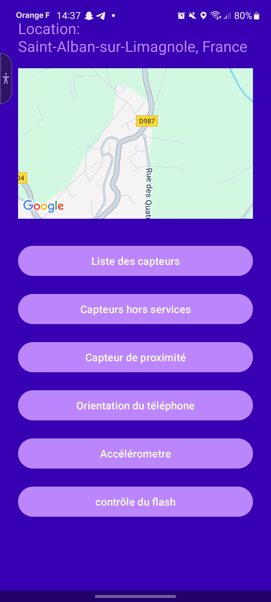
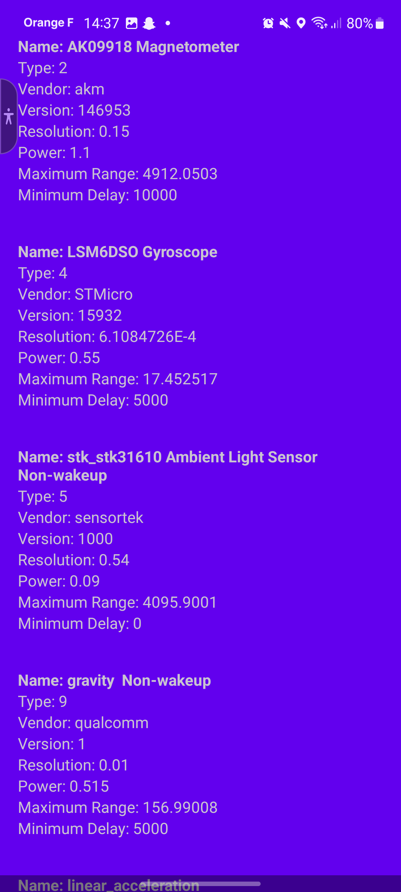
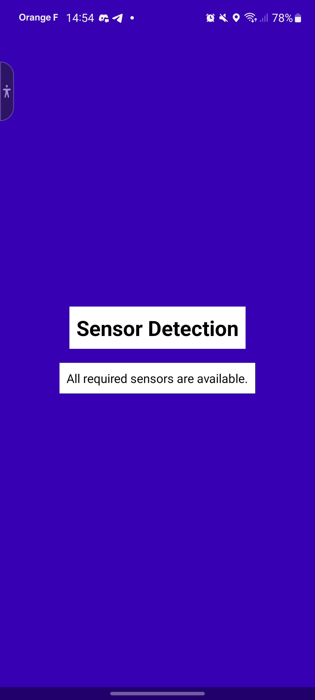
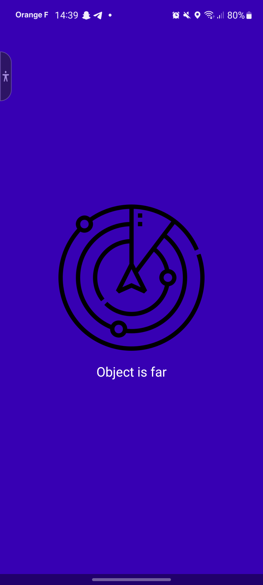
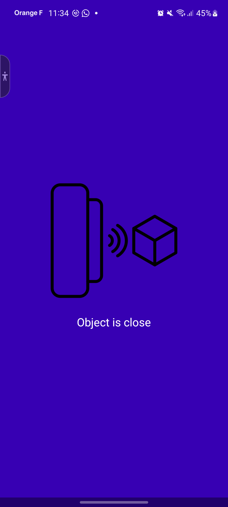
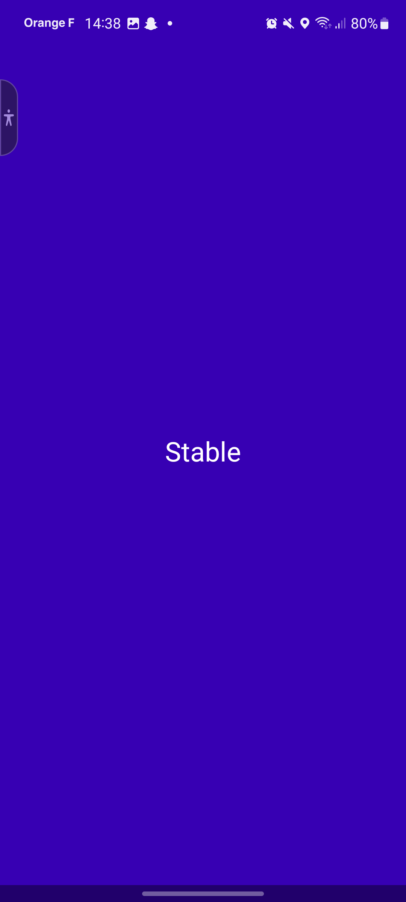
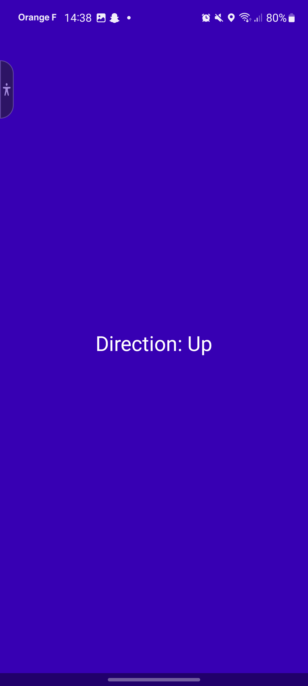
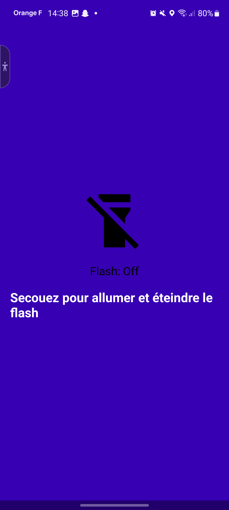
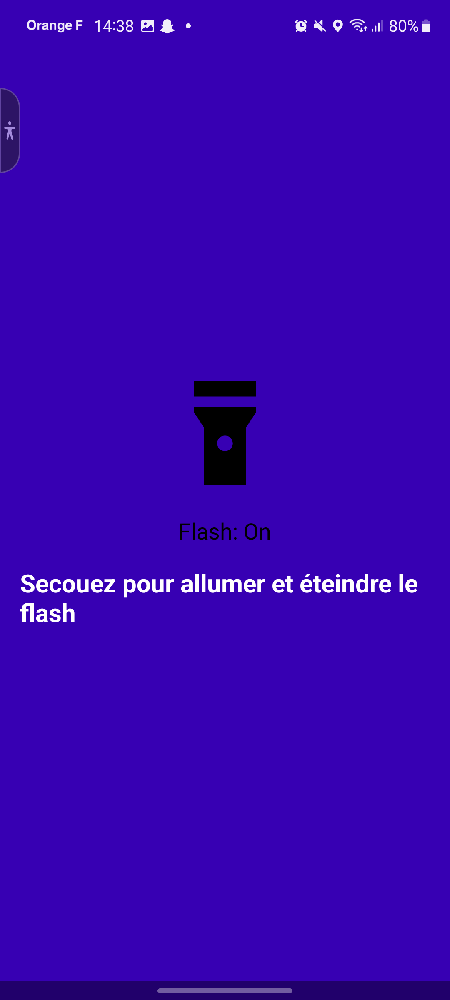

# TP2Part1

## Introduction
Cette application est conçue pour se familiariser avec l'utilisation de divers capteurs disponibles sur les appareils Android. L'application démontre l'utilisation de l'accéléromètre, du capteur de proximité et du capteur de vecteur de rotation... De plus, elle intègre l'API Google Maps pour afficher la position actuelle de l'utilisateur.

## Configuration du projet
Pour configurer le projet, suivez ces étapes :

1. Clonez le dépôt :
   ```bash
   git clone <repository-url>
   ```
2. Accédez au répertoire du projet :
   ```bash
   cd TP2Part1
   ```
3. Ouvrez le projet dans Android Studio.
4. Construisez le projet pour télécharger les dépendances nécessaires.

## Utilisation des capteurs

### Accéléromètre
L'accéléromètre est utilisé pour détecter les secousses et changer la couleur de fond en fonction de l'amplitude du vecteur d'accélération.

**Extrait de code :**
```kotlin
override fun onSensorChanged(event: SensorEvent) {
    if (event.sensor.type == Sensor.TYPE_ACCELEROMETER) {
        val x = event.values[0]
        val y = event.values[1]
        val z = event.values[2]

        // Calculer l'amplitude du vecteur d'accélération
        val magnitude = Math.sqrt((x * x + y * y + z * z).toDouble()).toFloat()

        // Déterminer la couleur en fonction de l'amplitude
        val color = when {
            magnitude < 10 -> Color.GREEN // Valeurs basses : vert
            magnitude > 20 -> Color.RED   // Valeurs élevées : rouge
            else -> Color.BLACK          // Valeurs moyennes : noir
        }

        // Définir la couleur de fond
        accelerometerColorLayout.setBackgroundColor(color)
    }
}
```

### Capteur de proximité
Le capteur de proximité est utilisé pour détecter la présence d'un objet près de l'appareil et mettre à jour l'interface utilisateur en conséquence.

**Extrait de code :**
```kotlin
override fun onSensorChanged(event: SensorEvent) {
    if (event.sensor.type == Sensor.TYPE_PROXIMITY) {
        val distance = event.values[0]
        if (distance < proximitySensor!!.maximumRange) {
            // L'objet est proche
            proximityImageView.setImageResource(R.drawable.close)
            proximityTextView.text = "L'objet est proche"
        } else {
            // L'objet est loin
            proximityImageView.setImageResource(R.drawable.far)
            proximityTextView.text = "L'objet est loin"
        }
    }
}
```

### Capteur de vecteur de rotation
Le capteur de vecteur de rotation est utilisé pour détecter l'orientation de l'appareil et afficher la direction (haut, bas, gauche, droite) en fonction des valeurs de tangage et de roulis.

**Extrait de code :**
```kotlin
override fun onSensorChanged(event: SensorEvent) {
    if (event.sensor.type == Sensor.TYPE_ROTATION_VECTOR) {
        val rotationMatrix = FloatArray(9)
        SensorManager.getRotationMatrixFromVector(rotationMatrix, event.values)

        val orientationValues = FloatArray(3)
        SensorManager.getOrientation(rotationMatrix, orientationValues)

        val azimuth = orientationValues[0] // Rotation autour de l'axe Z
        val pitch = orientationValues[1] // Rotation autour de l'axe X
        val roll = orientationValues[2] // Rotation autour de l'axe Y

        directionTextView.text = when {
            abs(pitch) > MOVEMENT_THRESHOLD -> if (pitch > 0) "Direction : Bas" else "Direction : Haut"
            abs(roll) > MOVEMENT_THRESHOLD -> if (roll > 0) "Direction : Droite" else "Direction : Gauche"
            else -> "Stable"
        }
    }
}
```

## Utilisation du flash

Le flash est utilisé pour s'allumer lorsque l'appareil est secoué. L'accéléromètre est utilisé pour détecter les secousses et activer le flash.

**Extrait de code :**

Contrôle de la sensibilité et du temps de réaction du capteur:

```kotlin
    private val SHAKE_THRESHOLD = 500 // Sensibilité du capteur
    private val SHAKE_TIME_THRESHOLD = 80L // latence du contrôle du flash
```

contrôle du flash et utilisation du cpateur :

```kotlin
override fun onSensorChanged(event: SensorEvent) {
    if (event.sensor.type == Sensor.TYPE_ACCELEROMETER) {
        val x = event.values[0]
        val y = event.values[1]
        val z = event.values[2]

        // Calculer l'amplitude du vecteur d'accélération
        val magnitude = Math.sqrt((x * x + y * y + z * z).toDouble()).toFloat()

        // Activer le flash si l'amplitude dépasse un certain seuil
        if (magnitude > 15) {
            flashControl(true)
        } else {
            flashControl(false)
        }
    }
}

private fun flashControl(turnOn: Boolean) {
    val cameraManager = getSystemService(Context.CAMERA_SERVICE) as CameraManager
    val cameraId = cameraManager.cameraIdList[0] // Supposons que l'appareil a un seul flash
    cameraManager.setTorchMode(cameraId, turnOn)
}
```

## Google Maps


L'API Google Maps est intégrée pour afficher la position actuelle de l'utilisateur sur une carte. Les permissions de localisation sont demandées et les mises à jour de localisation sont gérées pour mettre à jour la carte.

**Extrait de code :**
```kotlin
override fun onMapReady(googleMap: GoogleMap) {
    map = googleMap
    requestLocationPermissions()
    currentLocation?.let {
        updateMapLocation(it)
    }
}

private fun updateMapLocation(location: Location) {
    val latLng = LatLng(location.latitude, location.longitude)
    val cameraUpdate = CameraUpdateFactory.newLatLngZoom(latLng, 15f)
    map.animateCamera(cameraUpdate)
}
```

## Captures d'écran de l'interface


**Page d'acceuil :**

La disposition principale de l'application comprend un `TextView` pour afficher la localisation, un `SupportMapFragment` pour la carte, et une série de boutons pour naviguer vers différentes activités de capteurs.



**Liste des cpateurs :**

Cetta page contient la liste des capteurs de l'appareil et toutes leurs informations récupérables.





**Detection des capteurs hors services:**

Cette page a pour but d'afficher les capteurs hors services.



**Proximité :**

L'activité à pour but de tester le capteur de proximité. Attention, ce capteur n'est la même sur tous les appareil. Dans mon cas (Galaxy S20) le capteur est virtuel et utilise en réalité une combinaison de l'accéléromêtre, de la caméra frontale et du gyroscope. Pour le tester dans se cas là, il faut donc tenir sa main loin du téléphone, puis rapprocher le téléphone de celle ci et couvrir la caméra frontale avec. Lorsque le capteur détecte un objet, l'écran change et affiche "object is close".

<p align="center">
  
  
</p>

**Orientation :**

L'activité a pour but de donner l'orientation du téléphone à savoir haut, bas, gauche et droite. Quand le téléphone est à plat, "Stable" est affiché et quand un pointe vers le haut dans le cas du screen, "up" est affiché.

<p align="center">
  
  
</p>

**Accéléromètre :**

Cette activité à pour but de détecter plusieurs vitesses grâce à l'accéléromètre de l'appareil. un fond vert est affiché quand celui si est immobile, un fond noir pour un mouvement léger et un fond rouge pour un mouvement rapide.


**Contrôle du flash :**

Cette activité à pour but de controller le flash en secouant l'appareil.

<p align="center">
  
  
</p>